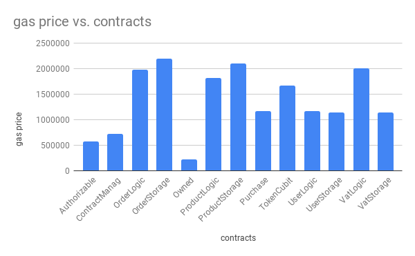
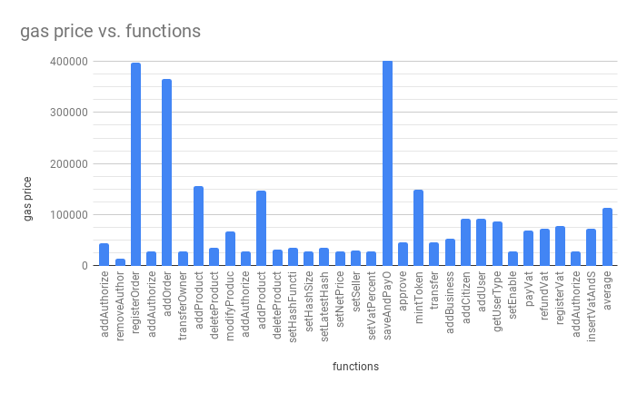
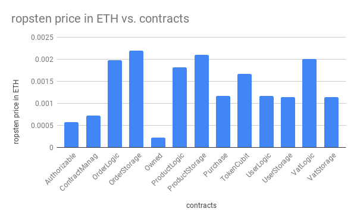
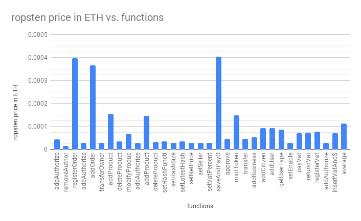
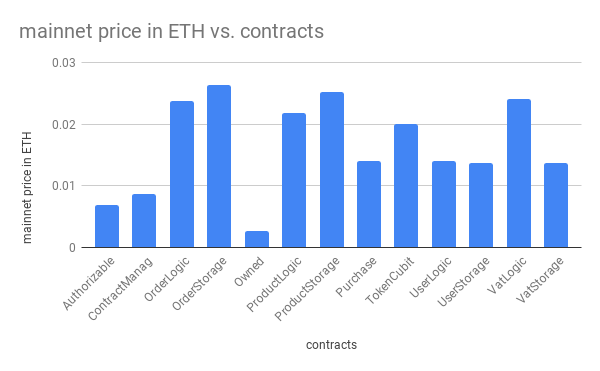
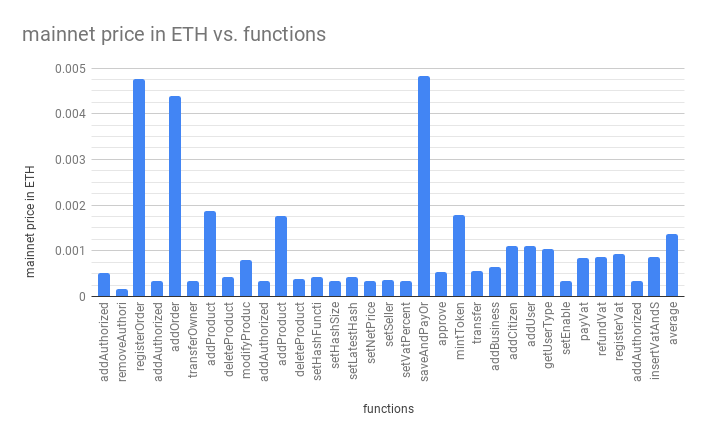

# Soldino

## Table of contents

- [References](#references)
- [Getting started](#getting-started)
- [Installation](#installation)
  * [Ubuntu](#ubuntu)
  * [Windows](#windows)
  * [Content of the repository](#content-of-the-repository)
  * [Configure Soldino for the local envirorment](#configure-soldino-for-the-local-envirorment)
    + [Configure Ganache](#configure-ganache)
    + [Run Soldino on the development environment](#run-soldino-on-the-development-environment)
+ [Authors](#authors)

## References

https://www.math.unipd.it/~tullio/IS-1/2018/Progetto/C6.pdf

Software Engineering project at University of Padua, developed for [Red Babel](http://redbabel.com/), by 8Lab Solutions.

## Getting started

In order to run Soldino you **must** have:

- `git`
- `nodejs v10.15.1` or later [see references](https://nodejs.org/en/)
- `npm v3.5.2` or later [see references](https://www.npmjs.com/get-npm)
- `truffle v5.0.5`   [ see references](https://www.truffleframework.com/docs/truffle/getting-started/installation)
- one or both: 
  - `Ganache GUI`  if you want an user interface for the local blockchain.
  - `ganache-cli` if you want fast local blockchain on command line.
- `metamask plugin` for `Google Chrome v64 or later` or `Mozilla Firefox v71 or later`

**Note** : *both* `Ganache GUI` *and* `ganache-cli` *(this is provided by default)*   **must**   *be set with port 9545 in order to run Soldino on the development environment, this port can be set later.*

## Installation

### Ubuntu

1. download or clone (`git clone https://github.com/8LabSolutions/Soldino-PoC.git` ) this repository 
2. run `$ npm install` in the repository folder (`Soldino-PoC` folder), it may take a while
   - If you have trouble with `$ npm install` run `$ sudo apt-get install build-essential` and retry run `npm install`
3. done!

### Windows

1. download or clone (`git clone https://github.com/8LabSolutions/Soldino-PoC.git` ) this repository
2. run `$ npm install` in the repository folder (`Soldino-PoC` folder), it may take a while
   - If you have trouble try this solution: [Microsoft.cpp.default.props not found(first answer)](https://stackoverflow.com/questions/41695251/c-microsoft-cpp-default-props-was-not-found) and retry run `npm install`
3. done!

**Note: npm run coverage doesn't work on Windows, so you can't use the coverage environment.**

### Content of the repository

The project's folders are organized in this way:

```
├── contracts/ (all solidity contracts' files)
|      ├── logic/ (logic contracts)
|      └── storage/ (storage contracts)
├── migration (files used to migrate contracts)
├── src/ (redux-react, web3 and ipfs folder)
|      ├── actions/ (all redux actions)
|      ├── actionCreators/ (all redux action creators)
|      ├── auxiliaryFunctions/ (utils functions for react and redux )
|      ├── components/
|      |    ├── containers/ (redux containers)
|      |    └── presentational/ (react presentational components)
|      ├── constants/ (utils for redux)
|      ├── contracts_build/ (jsons of contracts)
|      ├── facade/ (users classes)
|      ├── ipfsCalls/ (utils functions for connection to ipfs)
|      ├── reducers/ (all redux reducers)
|      ├── store/ (redux store)
|      ├── styles/ (css files)
|      └── web3functions/ (utils functions for connection to web3)
└── test/ (classes test system)
```

The folders organization separates the back end ad front end. 

------

### Configure Soldino for the local envirorment

In the `truffle-config.js` you can set all the options for your environment. There are three default environments configured:

- `development` : used as local environment it has the 9545 port set.

- `coverage`: used for the test coverage environment, port 8545. 

  To use this environment for run `$ npm run coverage`, it will not open the web page. 

  **Note: npm run coverage doesn't work on Windows.**

- `ropsten`: used to migrate contracts onto Ropsten test network.

#### Configure Ganache

In order to run Soldino DApp you have to open Ganache first. If you want to use `ganache-cli` open a new terminal and run `$ ganache-cli -p 9545` this will open a local blockchain on the port 9545. To see other configuration options please visit the [ganache-cli repository](https://github.com/trufflesuite/ganache-cli).

Otherwise, if you want to use Ganache GUI please follow these steps:

1. Open Ganache and click on "quickstart".
2. Click on the gear icon  in the top-left corner.
3. In the "SERVER" tab set 9545 in the "PORT NUMBER" field.
4. Click the "Save and restart" button in the top-left corner.

#### Run Soldino on the development environment

Run `$ npm start`. This command will deploy the contracts in `migrations/2_deploy_contracts.js`, Soldino will run on the `development` environment.

Soldino will open in your default browser on address: [localhost:3000](http://localhost:3000). 

Metamask will open at the same time. 

On Metamask tab, use option `Import using account seed phrase`.

Copy and paste MNEMONIC phrase that you can find on `Ganache GUI` on top of homepage.

Otherwise, if you use `ganache-cli` you can find it in terminal where you run `$ ganache-cli -p 9545`.

Insert new password, confirm it and click "Restore".

When you are logged in on Metamask, click the link on top-right of the tab and select "Custom RPC".

In "New RPC URL" textbox insert http://localhost:9545. 

and click "Save" button.

**Now you can enjoy Soldino!!**


## Costs
 
Soldino runs on Ethereum, where every transaction performed has a cost.<br/>
Every transaction comes with a gas price. Gas is like the fuel of Ethereum.<br/>
Here we have the gas cost of deploying the contracts and calling the functions contained in those contracts.





You may wanna try Soldino on Ropsten, a test network for Ethereum, before taking the big step.<br/>
These are the costs on Ropsten.





When you feel ready, land on the Main net, and enjoy the revenue of Soldino!<br/>
These are the costs.




## Authors

- [Federico Bicciato](https://github.com/nevepura)
- [Mattia Bolzonella](https://github.com/KamiShire)
- [Francesco Donè](https://github.com/francescodone)
- [Sara Feltrin](https://github.com/BluePerception)
- [Giacomo Greggio](https://github.com/giacomogreggio)
- [Samuele Giuliano Piazzetta](https://github.com/piaz97)
- [Paolo Pozzan](https://github.com/pozza96)
- [Matteo Santinon](https://github.com/MatteoSantinon)
